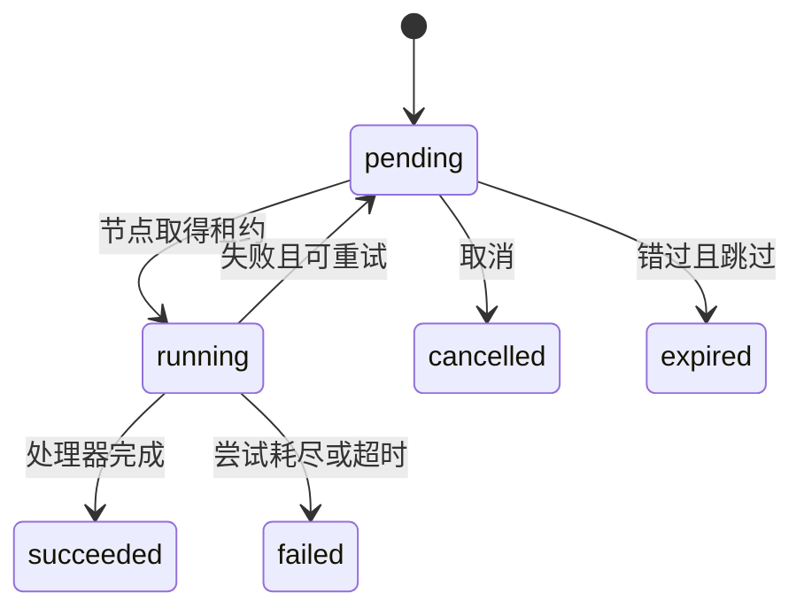

# 定时与延迟任务执行

## 目标与前置依赖

本技术需求定义周期触发、一次延迟执行、手动触发、取消、租约与执行记录。归属服务为 `scheduler`；前置依赖为 [定时与延迟任务定义](TR-scheduler-task-definition.md)。

## 接口契约

| Proto | Service | RPC | 类型 | 责任 |
| --- | --- | --- | --- |
| `scheduler/v1/scheduled_task.proto` | `SchedulerScheduledTaskService` | `Trigger`、`CancelExecution`、`PageExecutionRecords` | 内部技术接口 | 管理周期任务执行记录。 |
| `scheduler/v1/delayed_task.proto` | `SchedulerDelayedTaskService` | `Schedule`、`Trigger`、`CancelExecution`、`PageExecutionRecords` | 内部技术接口 | 创建和管理一次延迟执行。 |

两种 `*ExecutionRecord` 字段逐项使用 proto 定义：任务 ID、配置版本、`schedule_key,scheduled_at,started_at,finished_at,duration_ms,status,attempt,max_attempts,timeout_seconds,worker_id,payload,last_error,trace_id,misfire_policy,stale_after_seconds,created_at,updated_at`；延迟记录额外有 `idempotency_key`。状态转换为 `pending -> running -> succeeded|failed|cancelled|expired`，仅 `pending` 可取消；超时或租约过期将 `running` 置为 `failed` 或按剩余次数重回 `pending`。

`Schedule(task_key,payload,scheduled_at,idempotency_key)` 只接受已启用延迟配置和未来时点；唯一索引 `(delayed_task_id,idempotency_key)` 保证幂等，重试返回原记录。周期执行的唯一 `schedule_key` 由 `(task_key,config_version,scheduled_at)` 决定。`Trigger` 创建独立 `manual` 记录；周期任务用请求 payload 覆盖默认 payload，延迟任务空 payload 使用 `{}`。`allow_overlap=false` 时，同一任务只能有一条 `running` 记录。

工作节点用条件更新领取 `pending` 记录，写入 `worker_id,started_at` 和租约；完成只允许持有当前租约的节点更新。错过调度时按 `misfire_policy` 明确定义为跳过、补一次或按计划补齐，且补齐数量不超过 1。周期任务因 `skip` 在时效窗口外被丢弃时，消费者直接确认消息，不创建执行记录；取消必须用记录 ID，延迟取消还必须核对 `idempotency_key`。

错误码：`SCHEDULER_EXECUTION_NOT_FOUND`、`SCHEDULER_EXECUTION_NOT_CANCELLABLE`、`SCHEDULER_EXECUTION_IDEMPOTENCY_CONFLICT`、`SCHEDULER_TASK_DISABLED`、`SCHEDULER_SCHEDULE_TIME_INVALID`、`SCHEDULER_EXECUTION_LEASE_LOST`。验收时，并发节点至多执行同一记录一次；配置改版不改变执行快照；取消和完成竞态只能有一个最终状态。
